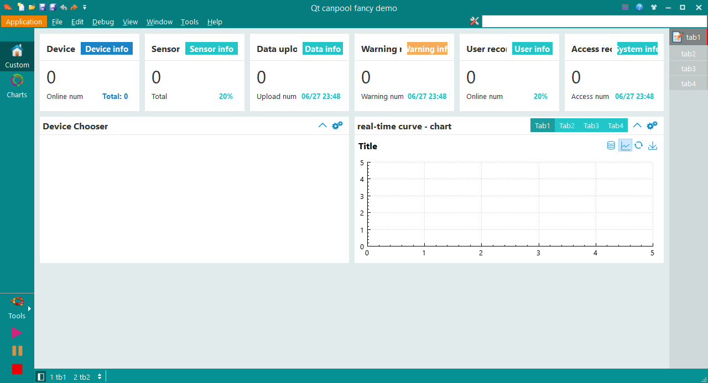
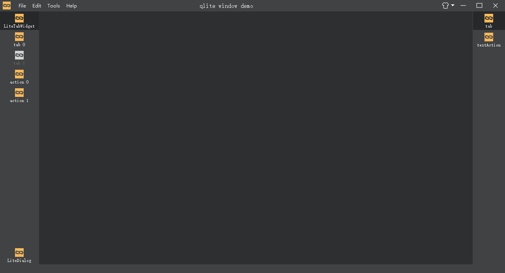
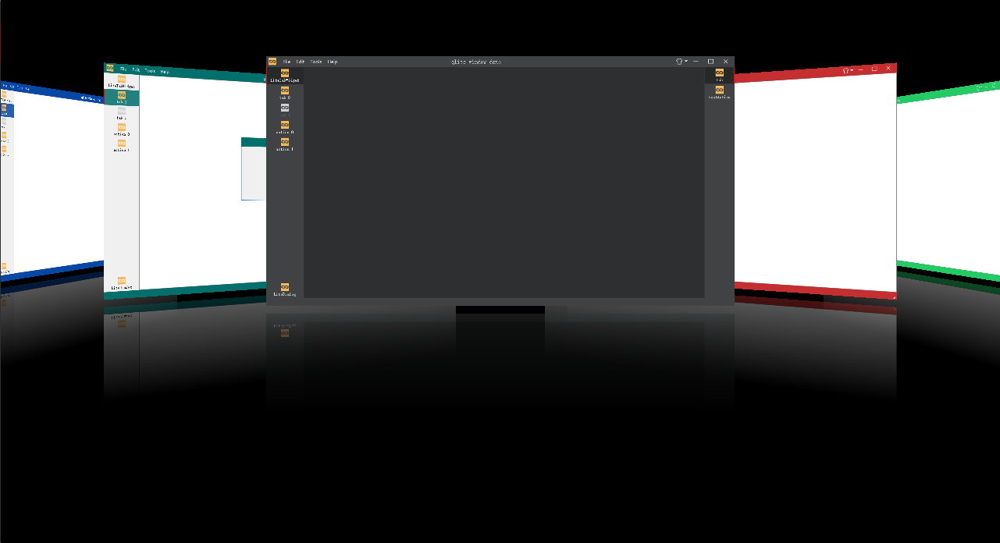

### 简介
本项目是根据QtCreator源码结构总结出的一套通用的项目管理模板。核心库为基于QtWidgets的qcanpool，同时，集成常用组件和第三方类库。

qtcanpool旨在提供给用户优秀的项目管理方式、多样的选择、优质的控件……

### 仓库
- [github](https://github.com/canpool/qtcanpool)
- [码云](https://gitee.com/icanpool/qtcanpool)

### 教程
- [使用教程](https://blog.csdn.net/canpool/category_10631139.html)
- [配套附件](https://pan.baidu.com/s/1o3d_IV2KWgcrnftaGVxFKA)
- [初学教程](https://blog.csdn.net/liang19890820/article/details/50277095#qt%E7%8E%AF%E5%A2%83%E4%B8%8E%E5%BC%80%E5%8F%91%E5%B7%A5%E5%85%B7)
- [学习之路](https://www.devbean.net/category/qt-study-road-2/)
- [Wiki](https://gitee.com/icanpool/qtcanpool/wikis)

### 目录
|一级目录|二级目录|说明|
|:------|:------|:------|
|demos||丰富的例子|
|doc||文档|
|projects||项目目录，其中提供简单的模板template，用户可以持续添加自己的项目在此目录， 从而实现一套框架管理多项目
|share||源代码中所需要的一些非代码共享文件
|src||源代码文件
||libs|基础类库，包含qcanpool、qlite、extensionsystem、aggregation、utils等
||modules|基础模块，包含qtoffice、qtqrcode、qcustomcontrols等
||shared|共享的实用代码文件
||tools|实用的工具
|thirdparty||第三方模块

### 环境
- Qt 5.12.0 Linux (travis ci)
- Qt 5.15.2 MinGW/MSVC2019 64bit
- 其它环境未测试，推荐使用[QT LTS](https://download.qt.io/official_releases/qt/)版本

### 版本
- 格式：x.y.z
- 说明：主版本.次版本.补丁版本
- 补充：主版本和次版本都可能存在重大变更，请查看CHANGELOG

### 协议
* 遵循GPLv3/LGPLv3开源许可协议

### 规范
* [Google C++ Style Guide](http://google.github.io/styleguide/cppguide.html)
* [Qt 编程风格与规范](https://blog.csdn.net/qq_35488967/article/details/70055490)
* 源文件采用UTF-8编码
* [仓库管理规范](./doc/仓库管理规范.md)

### 贡献
* 欢迎提交issue对关心的问题发起讨论
* 欢迎Fork仓库，pull request贡献

### 交流
* QQ群：831617934

### 例子
- fancyDemo

- qliteDemo

### 扩展
- [canopen](https://gitee.com/icanpool/canopen/blob/master/qtcanpool.md)
