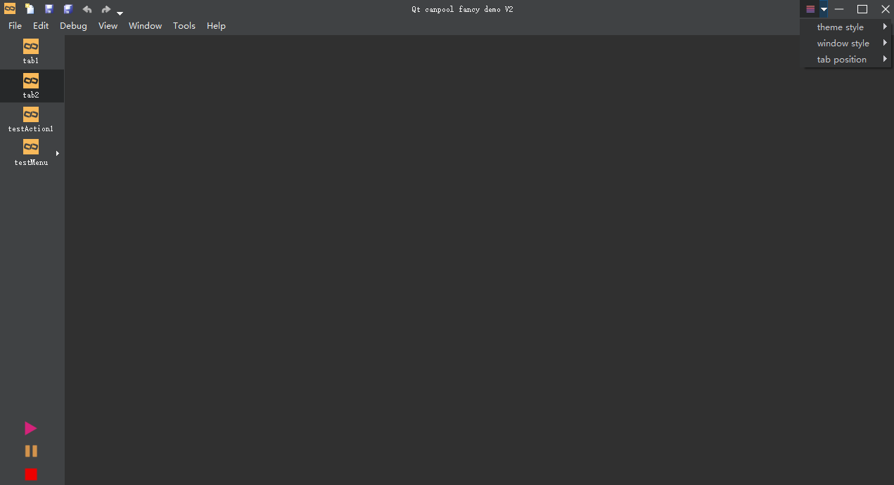
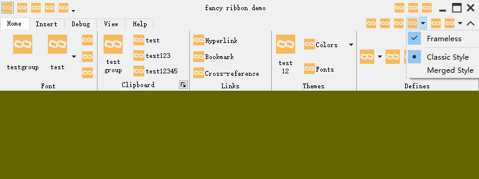
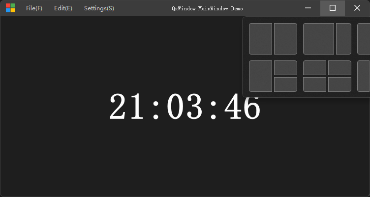
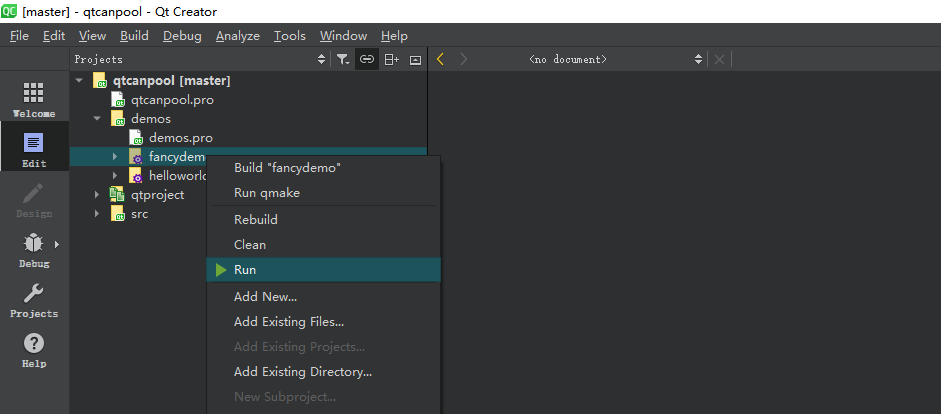
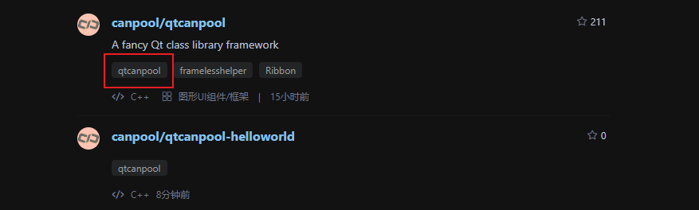

### 简介

本项目是根据 QtCreator 源码结构总结出的一套通用的项目管理模板。核心库为基于 QtWidgets 的 qcanpool，同时，集成常用组件和第三方类库。

qtcanpool 旨在提供给用户优秀的项目管理方式、多样的选择、优质的控件……

### 仓库

- github：[https://github.com/canpool/qtcanpool](https://github.com/canpool/qtcanpool)
- gitee：[https://gitee.com/icanpool/qtcanpool](https://gitee.com/icanpool/qtcanpool)

### 教程

- [使用教程](https://blog.csdn.net/canpool/category_10631139.html)
- [官方文档](https://blog.csdn.net/canpool/article/details/114523758)

### 目录

| 一级目录   | 二级目录 | 说明 |
| :--------- | :------- | :------- |
| cmake      |          | cmake框架 |
| demos      |          | 丰富的例子 |
| doc        |          | 文档 |
| examples   |          | 控件类的示例 |
| projects   |          | 项目目录，其中提供简单的模板 template，用户可以持续添加自己的项目在此目录，从而实现一套框架管理多项目 |
| scripts    |          | 辅助的脚本文件 |
| src        |          | 源代码文件 |
|            | libs     | 基础类库 |
|            | modules  | 基础模块，实用的代码，但不具备类库的规模 |
|            | plugins  | 基础插件 |
|            | shared   | 共享的实用代码文件 |
| tests      |          | 测试用例 |
| thirdparty |          | 使用第三方库的案例 |

### 环境

- Qt 6.8.1  MinGW/MSVC2022 64bit
- Qt 6.5.3  MinGW/MSVC2022 64bit
- Qt 5.15.2 MinGW/MSVC2022 64bit
- Qt 5.14.2 MinGW/MSVC2017 64bit
- 其它环境未测试，推荐使用 [QT LTS](https://download.qt.io/official_releases/qt/) 版本
- 补充测试环境（后期版本不保证）
    - Qt 5.12.12 MinGW/MSVC2017 64bit
    - Qt 5.11.1 gcc 64bit

### 版本

- 格式：x.y.z
- 说明：主版本.次版本.补丁版本

### 分支

- [master](https://gitee.com/icanpool/qtcanpool/tree/master/)：主线分支
- [develop](https://gitee.com/icanpool/qtcanpool/tree/develop/)：开发分支
- [release-x.y]()：版本分支，用于修复特定发布版本的问题

说明：

- 版本的发布以版本 tag 进行标记，若相应版本存在缺陷需要修复，将以版本分支的形式进行维护

### 协议

- 遵循 [MulanPSL2](./LICENSE) 开源许可协议
- 集成组件遵循 [各自](./LICENSE.NOTES.md) 开源许可协议

### 规范

- [Google C++ Style Guide](http://google.github.io/styleguide/cppguide.html)
- [Qt 编程风格与规范](https://blog.csdn.net/qq_35488967/article/details/70055490)
- 源文件全英文的采用 UTF-8 编码，包含中文的采用 UTF-8 with BOM 编码
- 代码 git 提交格式：[git 知：提交格式](https://blog.csdn.net/canpool/article/details/126005367)

### 贡献

- 欢迎提交 issue 对关心的问题发起讨论
- 欢迎 Fork 仓库，pull request 贡献
- 贡献者可在文件头版权中添加个人信息，格式如下：

```
/**
 * Copyright (C) YYYY NAME <EMAIL>
 * Copyright (C) 2023 maminjie <canpool@163.com>
 * SPDX-License-Identifier: MulanPSL-2.0
**/
```

### 交流

- QQ 群：831617934（Qt 业余交流）

### 例子

- <font size=4>fancydemo</font>



- <font size=4>fancyribbon</font>



- <font size=4>dockdemo</font>


- <font size=4>ribbondemo</font>


最新版本效果图：


- <font size=4>qxwindow demo</font>



### 体验

下载源码，使用 qtcreator 打开 qtcanpool.pro，然后右击 fancydemo 并单击 Run 体验，如下所示：


### 扩展

本仓库未来将只维护核心库，其它库将以单独的 qtcanpool-LIBNAME 仓库进行维护。可以通过 qtcanpool 标签进行检索：



### 后语

如果您觉得本项目对您有很大帮助，您可以赞助本项目，助其更好的发展。

赞助方式：


赞助名单：[名单](./doc/sponsor/sponsor.md)
