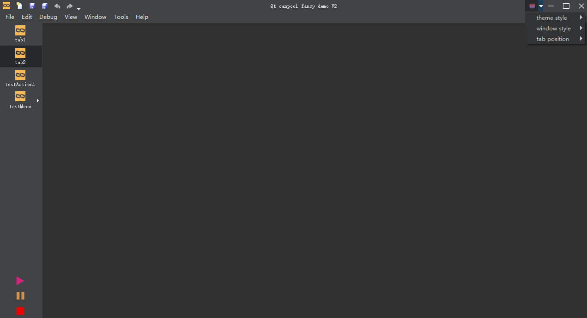
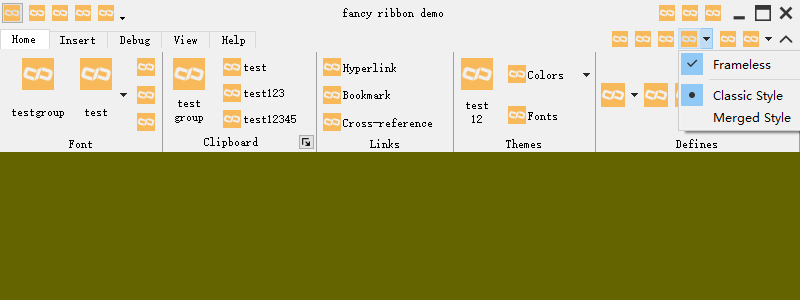
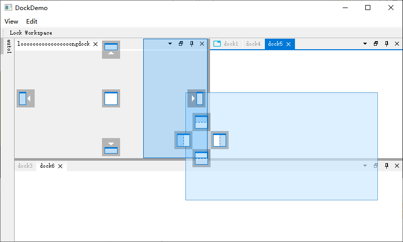
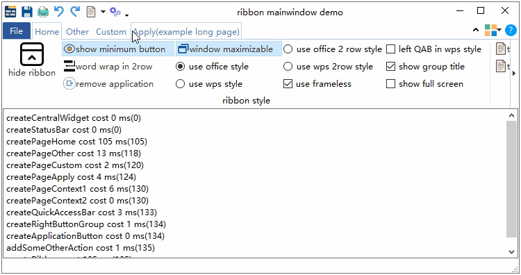
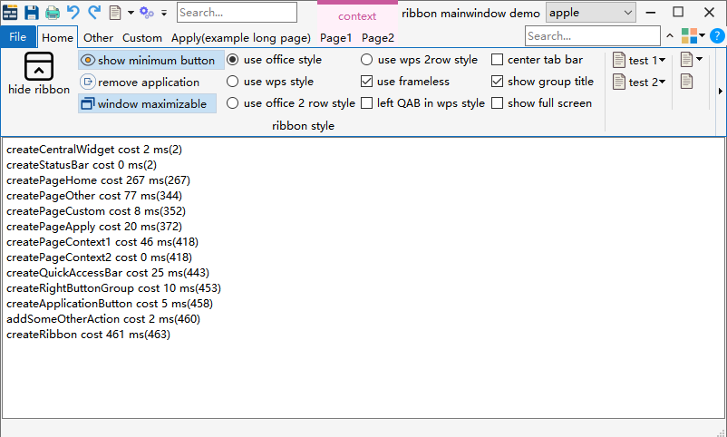
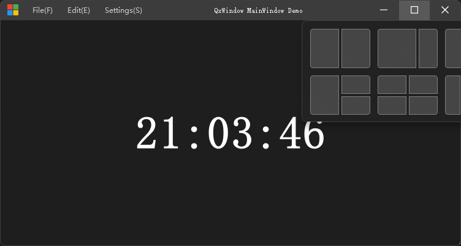
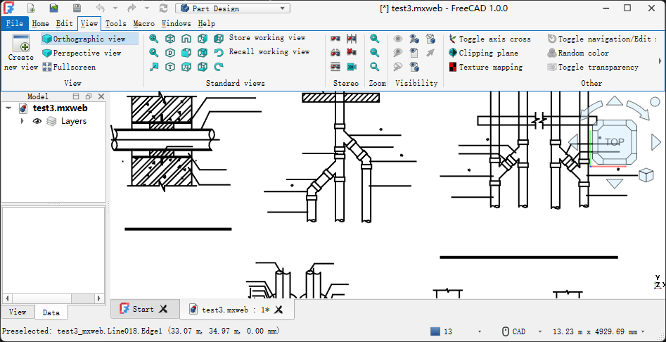
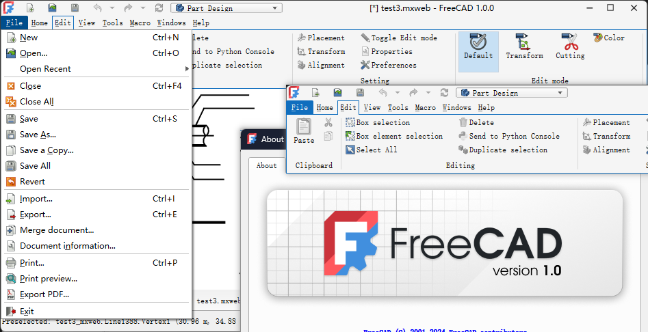
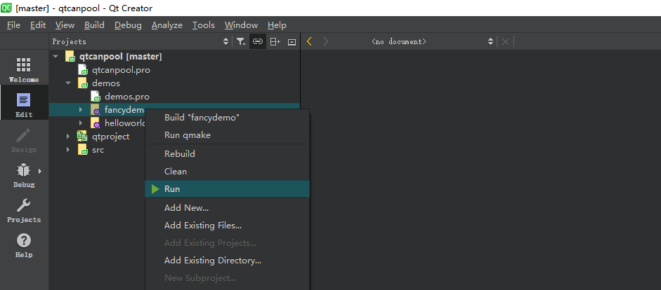
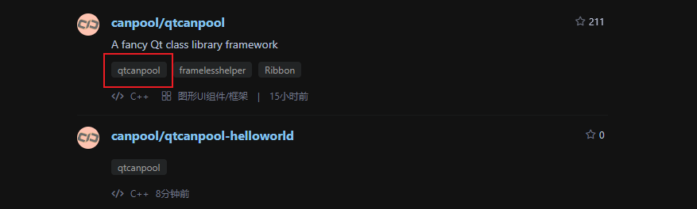

# qtcanpool

<div align="center">

[](https://github.com/canpool/qtcanpool/actions/workflows/ci.yml)
[](./LICENSE)
[](https://www.qt.io/)
[](https://isocpp.org/)

</div>

一套总结自 Qt Creator 源码结构的通用项目管理模板，核心库 **qcanpool** 基于 QtWidgets 构建，并集成了 Ribbon、可停靠窗口（Dock）、自定义窗口（Window）等常用界面组件与第三方类库。

qtcanpool 旨在提供优秀的项目管理方式、多样的选择与优质的控件。

## 主要组件

| 组件 | 命名空间 | 说明 |
| :--- | :------- | :--- |
| **qxcore** | `QxCore` | 基础设施库：配置（`QxSettings`）、日志（`QxLogger`），仅依赖 Qt Core |
| **qxtheme** | `QxTheme` | 主题引擎：调色板 + 样式表统一应用（Office / WPS / Dark）、运行时切换、选择持久化、跟随系统深浅色 |
| **qcanpool** | `QCanpool` | 核心库，提供标题栏、工具按钮等通用控件；集成并封装下列组件 |
| **qxribbon** | `QxRibbon` | Ribbon 风格界面组件（菜单栏 / 页 / 分组等） |
| **qxdock** | `QxDock` | 可停靠窗口组件（布局管理、浮动容器等） |
| **qxwindow** | `QxWindow` | 自定义窗口组件（无边框窗口、系统按钮代理等） |
| **qxapp** | `QxApp` | 应用层通用控件集合 |
| **qtcompat** | — | Qt 5 / Qt 6 跨版本兼容辅助头（header-only） |

## 仓库

- GitHub：[https://github.com/canpool/qtcanpool](https://github.com/canpool/qtcanpool)
- Gitee：[https://gitee.com/icanpool/qtcanpool](https://gitee.com/icanpool/qtcanpool)

## 教程

- [使用教程](https://blog.csdn.net/canpool/category_10631139.html)
- [官方文档](https://blog.csdn.net/canpool/article/details/114523758)

## 目录结构

| 一级目录 | 二级目录 | 说明 |
| :------- | :------- | :--- |
| `cmake` | | CMake 构建框架 |
| `demos` | | 综合示例程序 |
| `doc` | | 文档 |
| `examples` | | 控件级示例 |
| `projects` | | 项目目录，提供 template 模板；可在此持续添加自己的项目，实现一套框架管理多项目 |
| `scripts` | | 辅助脚本 |
| `src` | `libs` | 基础类库 |
| | `modules` | 基础模块：实用的代码，但未形成类库规模 |
| | `plugins` | 基础插件 |
| | `shared` | 共享的实用代码 |
| `tests` | | 单元测试（CTest） |
| `thirdparty` | | 第三方库使用案例 |

## 环境要求

**自 3.0 起的基线：**

- Qt **5.15** 及以上（主推 Qt 6.5 / 6.8 LTS）
- C++17
- CMake 3.16+（推荐最新版本）

**历史测试环境**（2.x 时期验证，3.0 不再保证）：

- Qt 6.8.1 / 6.5.3 / 5.15.2 / 5.14.2 / 5.12.12 / 5.11.1（MinGW / MSVC，64bit）
- 其它环境未测试，推荐使用 [Qt LTS](https://download.qt.io/official_releases/qt/) 版本

## 构建

**CMake 为主要构建方式**（qmake 自 3.0 起冻结为只读，后续版本移除）。

```bash
# 配置（Qt 通过 CMAKE_PREFIX_PATH 指定）
cmake -S . -B build -DCMAKE_PREFIX_PATH=<Qt安装目录>/<版本>/<编译器> -DCMAKE_BUILD_TYPE=Release

# 编译
cmake --build build --config Release --parallel

# 运行单元测试
ctest --test-dir build -C Release --output-on-failure
```

说明：

- 各功能开关（`WITH_DEMOS`、`WITH_TESTS` 等）可通过 `cmake -S . -B build -LH` 查看
- 亦可使用 Qt Creator 直接打开根目录 `CMakeLists.txt`（或早期兼容的 `qtcanpool.pro`）

## 路线图

- [3.0 开发规划](./doc/ROADMAP-3.0.md)
- [2.x → 3.0 迁移指南](./doc/design/3.0-MIGRATION.md)
- [M1 任务清单](./doc/design/3.0-M1-TASKS.md)

## 版本

- 格式：`x.y.z`（主版本.次版本.补丁版本）

## 分支

| 分支 | 说明 |
| :--- | :--- |
| [master](https://gitee.com/icanpool/qtcanpool/tree/master/) | 主线分支 |
| [develop](https://gitee.com/icanpool/qtcanpool/tree/develop/) | 开发分支 |
| [release-x.y](https://gitee.com/icanpool/qtcanpool/tree/release-3.x/) | 版本分支，用于维护特定发布版本 |

- 版本发布以 tag 标记；若某版本存在需修复的缺陷，将以对应版本分支的形式进行维护

## 开发规范

- C++ 风格：[Google C++ Style Guide](http://google.github.io/styleguide/cppguide.html)、[Qt 编程风格与规范](https://blog.csdn.net/qq_35488967/article/details/70055490)
- 源文件编码：全英文源文件采用 UTF-8；包含中文的采用 UTF-8 with BOM
- **代码中的注释一律使用英文**（文档等 `.md` 文件不拘）
- 代码格式化：随仓库提供 [`.clang-format`](./.clang-format)（C++17），CI 中作为强制门禁
- Git 提交格式（**自 3.0 起**）：`type(scope): subject`，以区分早期提交格式
  - 提交信息一律使用**英文**（subject 与正文）
  - `type`：`feat` / `fix` / `docs` / `style` / `refactor` / `perf` / `test` / `build` / `ci` / `chore` / `revert`
  - `scope`：受影响范围，如 `qxcore` / `qxtheme` / `qxribbon` / `qxdock` / `qxwindow` / `qxapp` / `qcanpool` / `project` / `ci` / `test` / `docs`
  - 示例：`feat(qxribbon): add ribbon gallery group`、`fix(qxwindow): fix taskbar coverage on secondary screen`
  - 早期提交格式参考：[git 知：提交格式](https://blog.csdn.net/canpool/article/details/126005367)

## 贡献

- 欢迎提交 [issue](https://github.com/canpool/qtcanpool/issues) 对关心的问题发起讨论
- 欢迎 Fork 仓库并通过 pull request 贡献代码
- 贡献者可在文件头版权中添加个人信息，格式如下：

```cpp
/**
 * Copyright (C) YYYY NAME <EMAIL>
 * Copyright (C) 2023 maminjie <canpool@163.com>
 * SPDX-License-Identifier: MulanPSL-2.0
**/
```

## 示例

**fancydemo**



**fancyribbon**



**dockdemo**



**ribbondemo**



最新版本效果图：



**qxwindow demo**



## 应用案例

**MyCAD**




MyCAD 是基于 [FreeCAD](https://github.com/FreeCAD/FreeCAD)-1.0.0 源码集成 QxRibbon 组件的作品，旨在实现 FreeCAD 的现代化界面（Ribbon 风格）。

## 快速体验

下载源码，使用 Qt Creator 打开 `qtcanpool.pro`，右击 `fancydemo` 并选择 *Run* 即可体验：



## 扩展

本仓库未来将只维护核心库，其它库将以独立的 `qtcanpool-LIBNAME` 仓库维护，可通过 `qtcanpool` 标签检索：



## 赞助

如果您觉得本项目对您有帮助，欢迎赞助，助力项目更好地发展。


赞助名单：[名单](./doc/sponsor/sponsor.md)

## 交流

- QQ 群：831617934（Qt 业余交流）

## 许可

- 本项目遵循 [MulanPSL-2.0](./LICENSE) 开源许可协议
- 集成组件遵循[各自](./LICENSE.NOTES.md)的开源许可协议
