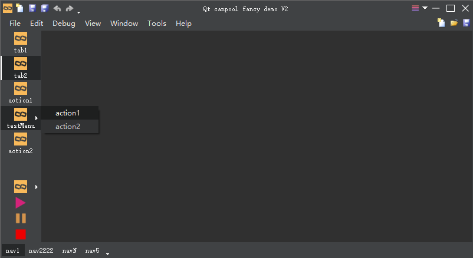
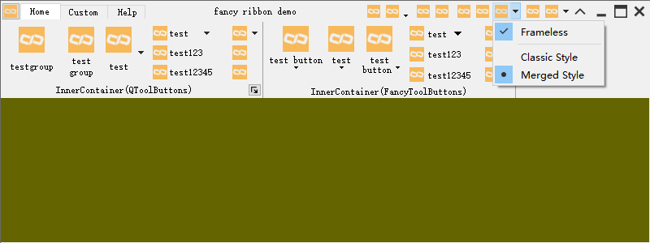

### 简介
本项目是根据 QtCreator 源码结构总结出的一套通用的项目管理模板。核心库为基于 QtWidgets 的 qcanpool，同时，集成常用组件和第三方类库。

qtcanpool 旨在提供给用户优秀的项目管理方式、多样的选择、优质的控件……

### 仓库
- [github](https://github.com/canpool/qtcanpool)
- [码云](https://gitee.com/icanpool/qtcanpool)

### 教程
- [使用教程](https://blog.csdn.net/canpool/category_10631139.html)
- [初学教程](https://blog.csdn.net/liang19890820/article/details/50277095)
- [学习之路](https://www.devbean.net/category/qt-study-road-2/)

### 目录
|一级目录|二级目录|说明|
|:------|:------|:------|
|demos||丰富的例子|
|doc||文档|
|projects||项目目录，其中提供简单的模板 template，用户可以持续添加自己的项目在此目录，从而实现一套框架管理多项目
|src||源代码文件
||libs|基础类库
||modules|基础模块
||plugins|基础插件
||shared|共享的实用代码文件

### 环境
- Qt 5.15.2 MinGW/MSVC2019 64bit
- Qt 5.14.2 MinGW 64bit
- 其它环境未测试，推荐使用 [QT LTS](https://download.qt.io/official_releases/qt/) 版本

### 版本
- 格式：x.y.z
- 说明：主版本.次版本.补丁版本

### 分支
- [master](https://gitee.com/icanpool/qtcanpool/tree/master/)：V2 版本的主分支
- [v1_master](https://gitee.com/icanpool/qtcanpool/tree/v1_master/)：V1 版本的主分支

说明：
- v1_master 分支停止维护，只修复严重 bug

### 协议
* 遵循 [MulanPSL2](./LICENSE) 开源许可协议
* 集成组件遵循各自开源许可协议

### 规范
* [Google C++ Style Guide](http://google.github.io/styleguide/cppguide.html)
* [Qt 编程风格与规范](https://blog.csdn.net/qq_35488967/article/details/70055490)
* 源文件采用 UTF-8 编码

### 贡献
* 欢迎提交 issue 对关心的问题发起讨论
* 欢迎 Fork 仓库，pull request 贡献

### 交流
* QQ群：831617934

### 例子
1）fancydemo

2）fancytitlebar

支持 windows 原生特性（毛玻璃预览，半屏和¼屏等显示效果）

3）fancyribbon

4）fancytoolbutton

5）qrcodedemo

6）ribbondemo

### 体验
下载源码，使用 qtcreator 打开 qtcanpool.pro，然后右击 fancydemo 并单击 Run 体验，如下所示：

### 其它
- [qtcanpool-extend](https://gitee.com/icanpool/qtcanpool-extend)：qtcanpool extend libraries
- [QxRibbon](https://gitee.com/icanpool/QxRibbon)：Microsoft Ribbon for Qt
- [QxDock](https://gitee.com/icanpool/QxDock)：Advanced Docking System for Qt
